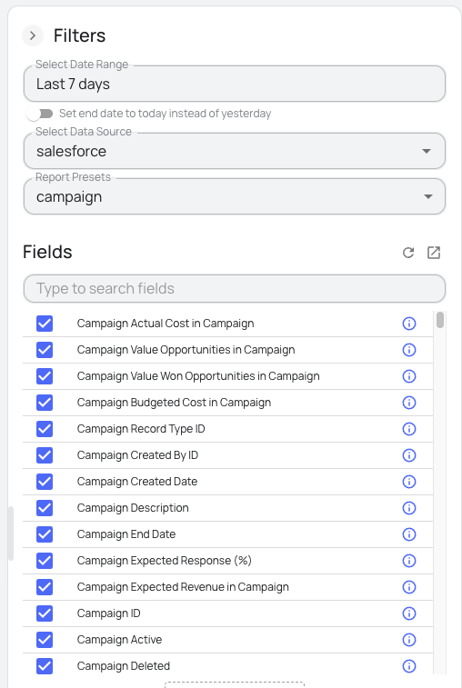

# dbt-BigQuery Package for Salesforce Campaign Funnel Data

A production-ready dbt package that transforms raw Salesforce data integrated with [Windsor.ai](https://windsor.ai/) into clean, analytics ready tables in BigQuery following standardized architecture patterns.

You can find a complete list of [available Salesforce fields here](https://windsor.ai/data-field/salesforce/).


## 🚀 Features of this dbt package:

- **Multi-level data modeling**: Structured models for campaigns, leads, contacts, and opportunities
- **Campaign funnel analytics**: Complete lead → contact → opportunity attribution tracking
- **Business KPIs out of the box**: Pre-calculated metrics like conversion rates, campaign ROI, and lead progression timing
- **Reusable macros**: Modular macros for consistent metric calculation and data transformation
- **Custom tests**: Built-in tests to ensure data quality and prevent duplicates
- **Type safety**: Safe and consistent casting of strings to numeric types using safe_cast
- **Performance optimized**: Designed for BigQuery efficiency with native data types and filter logic
- **Built for Windsor.ai**: Tailored to Windsor.ai's Salesforce schema and sync behavior
- **Executive dashboards**: Ready-to-use models for business intelligence

## What does this dbt package do?

This package transforms raw Salesforce data into clean, analytics ready tables modeling the complete **Campaign → Lead → Contact → Campaign Member → Opportunity** funnel. It provides:

- **Campaign ROI analysis**: Track performance metrics across campaigns
- **Lead conversion tracking**: Monitor progression with timing analytics  
- **Multi touch attribution**: Understand campaign touchpoint impact
- **Executive dashboards**: Ready to use models for business intelligence
- **Data quality assurance**: Built in validation and testing

## ⚙️ Prerequisites:

Before using this package, you have to integrate Salesforce data into BigQuery using the [Windsor.ai connector](https://windsor.ai/connect/salesforce-google-bigquery-integration/) to ensure the schema matches the expected format:

1. [Sign up](https://onboard.windsor.ai/) for Windsor.ai's free trial.
2. Connect your Salesforce account(s).
3. Choose BigQuery as a data destination.
4. Create and run a destination task for each of the 5 required tables by selecting specific fields. You can use the Report Presets dropdown to automatically select the necessary fields for each model (campaigns, leads, contacts, campaign_members, opportunities).



## ✅ Required BigQuery tables

These tables must be created with the field structure defined in the sources.yml file:

**campaigns**
- Campaign-level info such as names, types, status, and budgets
- Key fields: id, name, type, status, start_date, end_date, budgeted_cost, actual_cost, is_active

**leads**
- Lead records with contact information and source tracking
- Key fields: id, email, first_name, last_name, company, status, lead_source, created_date, converted_date, converted_contact_id, converted_opportunity_id

**contacts**
- Contact master data with account relationships
- Key fields: id, email, first_name, last_name, account_id, created_date, lead_source

**campaign_members**
- Campaign membership associations linking campaigns to leads/contacts
- Key fields: id, campaign_id, lead_id, contact_id, status, first_responded_date, created_date

**opportunities**
- Sales opportunity pipeline data with campaign attribution
- Key fields: id, name, account_id, amount, stage_name, close_date, campaign_id, created_date, is_closed, is_won

Windsor.ai will stream your Salesforce data to your BigQuery project in minutes. After verifying that the data is present, you're ready to start transforming it using this dbt package.

## 📋 Requirements

To use this dbt package, you must have the following:

- **dbt Core** >= 1.0.0
- **BigQuery** data warehouse (currently supported)
- **Salesforce source data** synced to your data warehouse via Windsor.ai
- The following source tables available in your BigQuery project:
  - `campaigns`
  - `leads` 
  - `contacts`
  - `campaign_members`
  - `opportunities`

## 🚀 Quick Start

### Step 1: Install the Package

Add to your `packages.yml`:

```

packages:

- git: "https://github.com/carlosarturoleon/dbt-salesforce-campaign-funnel.git"
revision: main

```

### Step 2: Install Dependencies

```

dbt deps

```

### Step 3: Configure Source Tables

Define your Salesforce source tables in `models/sources.yml`:

```

version: 2

sources:

- name: salesforce
description: "Raw Salesforce data tables"
tables:
    - name: campaigns
description: "Salesforce campaigns data"
    - name: leads
description: "Salesforce leads data"
    - name: contacts
description: "Salesforce contacts data"
    - name: campaign_members
description: "Campaign member associations"
    - name: opportunities
description: "Sales opportunities data"

```

### Step 4: Run the Models

```


# Run all models

dbt run

# Run specific layers

dbt run --select +stg_salesforce    \# Staging only
dbt run --select +int_salesforce    \# Staging + Intermediate
dbt run --select +salesforce        \# All models

# Run tests

dbt test

```

## 🏗️ Package Architecture

This package follows dbt best practices with a three layer architecture:

### **Staging Models** (`stg_salesforce__*`)
Clean and standardize raw Salesforce data with:
- Data type standardization
- Consistent field naming
- Basic data validation
- Null handling

### **Intermediate Models** (`int_salesforce__*`)  
Business logic and metric calculations including:
- Lead journey progression tracking
- Campaign performance aggregations
- Attribution calculations
- Conversion timing analysis

### **Marts Models** (`salesforce__*`)
Analytics ready final tables optimized for:
- Executive reporting
- Dashboard integration
- BigQuery performance (partitioned/clustered)
- Business user consumption

## 📊 Models Reference

| **Model** | **Description** |
|-----------|-----------------|
| `stg_salesforce__campaigns` | Cleaned campaign master data |
| `stg_salesforce__leads` | Standardized lead information |
| `stg_salesforce__contacts` | Clean contact records |
| `stg_salesforce__campaign_members` | Campaign membership data |
| `stg_salesforce__opportunities` | Opportunity pipeline data |
| `int_salesforce__lead_journey` | Lead progression and timing |
| `int_salesforce__campaign_performance` | Campaign metrics and KPIs |
| `int_salesforce__contact_touchpoints` | Contact interaction history |
| `salesforce__campaign_lead_funnel` | **Complete funnel analysis** |
| `salesforce__campaign_attribution_summary` | **Multi-touch attribution reporting** |

## 🛠 How to use this dbt package

### Configure your dbt_project.yml:
```yaml
vars:  
  # Date range for processing (adjust as needed)
  start_date: '2020-01-01'
  end_date: '2024-12-31'
  
  # Currency settings
  target_currency: 'USD'
  
  # Data quality filters
  exclude_test_campaigns: true
  exclude_deleted_records: true
```

Make sure these source tables are available in your BigQuery project:
- campaigns
- leads
- contacts
- campaign_members
- opportunities

Run the models:
```bash
# Run all models  
dbt run

# Run specific layers  
dbt run --select +stg_salesforce    # Staging only  
dbt run --select +int_salesforce    # Staging + Intermediate  
dbt run --select +salesforce        # All models

# Run tests  
dbt test
```

## ⚙️ Configuration Options

### Custom Field Mapping

Adapt to your Salesforce org schema by overriding field mappings in `dbt_project.yml`:

```yaml
vars:
# Campaign field mappings
campaigns_id_field: 'campaign_id'
campaigns_name_field: 'campaign_name'
campaigns_type_field: 'campaign_type'
campaigns_status_field: 'campaign_status'
campaigns_actual_cost_field: 'campaign_actual_cost'
campaigns_budgeted_cost_field: 'campaign_budgeted_cost'

# Lead field mappings
leads_id_field: 'lead_id'
leads_email_field: 'lead_email'
leads_status_field: 'lead_status'
leads_source_field: 'lead_lead_source'
leads_converted_date_field: 'lead_converted_date'
leads_converted_contact_id_field: 'lead_converted_contact_id'

# Contact field mappings  
contacts_id_field: 'contact_id'
contacts_email_field: 'contact_email'
contacts_account_id_field: 'contact_accountid'
contacts_created_date_field: 'contact_createddate'

# Campaign Member field mappings
campaign_members_id_field: 'campaignmember_id'
campaign_members_campaign_id_field: 'campaignmember_campaign_id'
campaign_members_lead_id_field: 'campaignmember_lead_id'
campaign_members_contact_id_field: 'campaignmember_contact_id'

# Opportunity field mappings
opportunities_id_field: 'opportunity_id'
opportunities_name_field: 'opportunity_name'
opportunities_amount_field: 'opportunity_amount'
opportunities_stage_name_field: 'opportunity_stage_name'
opportunities_campaign_id_field: 'opportunity_campaign_id'
```

### Picklist Value Configuration

Configure picklist values to match your Salesforce org:

```

vars:
salesforce_campaign_types:
- 'Email'
- 'Webinar'
- 'Trade Show'
- 'Social Media'

salesforce_lead_statuses:
- 'Open - Not Contacted'
- 'Working - Contacted'
- 'Qualified'
- 'Unqualified'

```

### Schema Configuration

Customize output schemas:

```

models:
salesforce_campaign_funnel:
+schema: my_salesforce_schema
staging:
+schema: my_staging_schema
intermediate:
+schema: my_intermediate_schema

```

## 🔧 Utility Macros

The package includes helper macros for data transformations:

- `clean_boolean()` - Convert string booleans to proper boolean type
- `clean_email()` - Standardize and validate email addresses  
- `safe_date_parse()` - Robust date parsing with error handling
- `calculate_days_between()` - Date difference calculations
- `clean_currency()` - Numeric/currency field validation
- `clean_phone()` - Phone number standardization

## 🧪 Data Quality & Testing

Built-in data quality tests include:

- **Uniqueness**: Primary key constraints on all models
- **Referential integrity**: Foreign key relationships between tables  
- **Data validation**: Email format, date ranges, picklist values
- **Business logic**: Conversion funnel consistency checks
- **Completeness**: Required field validation

Run tests with:
```

dbt test
dbt test --select stg_salesforce  \# Test staging models only

```

## 📈 Use Cases

Perfect for organizations looking to:

- **Measure marketing ROI** across Salesforce campaigns
- **Optimize lead conversion** with detailed funnel analysis  
- **Understand attribution** across multiple touchpoints
- **Build executive dashboards** with campaign performance
- **Track sales pipeline** from marketing source to closed won

## 🤝 Contributing

We welcome contributions! Please:

1. Fork the repository
2. Create a feature branch
3. Add tests for any new functionality  
4. Submit a pull request with clear description

## 📝 License

This project is licensed under the MIT License - see the [LICENSE](LICENSE) file for details.